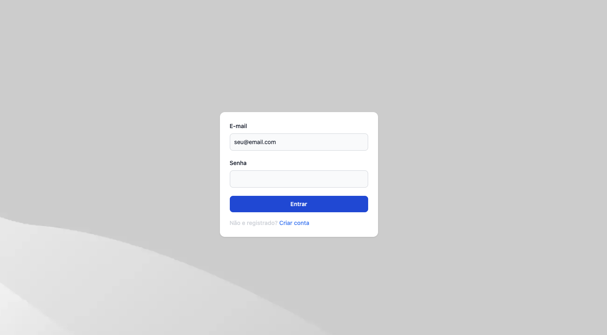
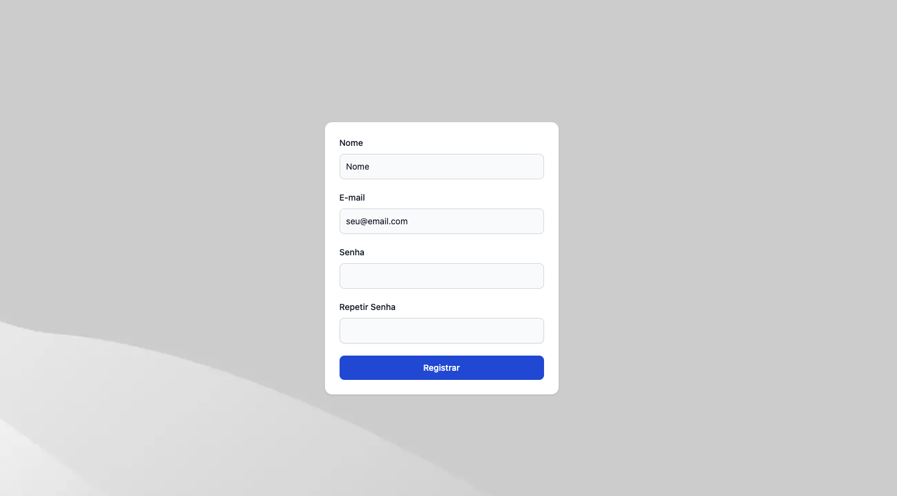
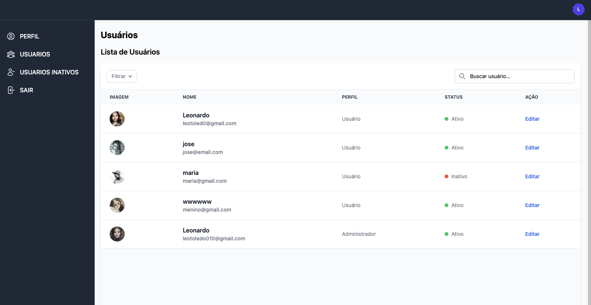
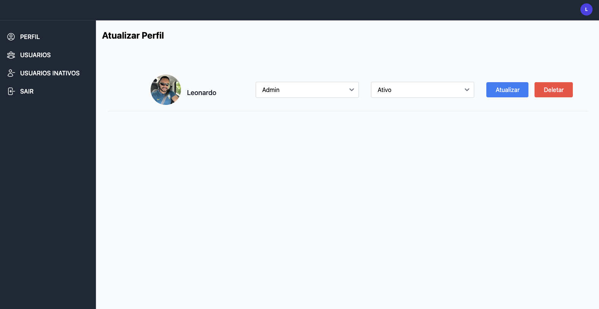
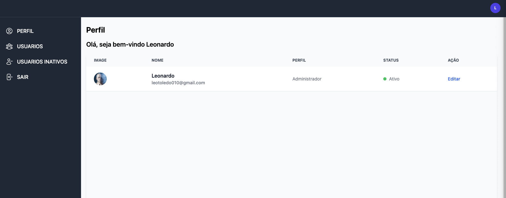
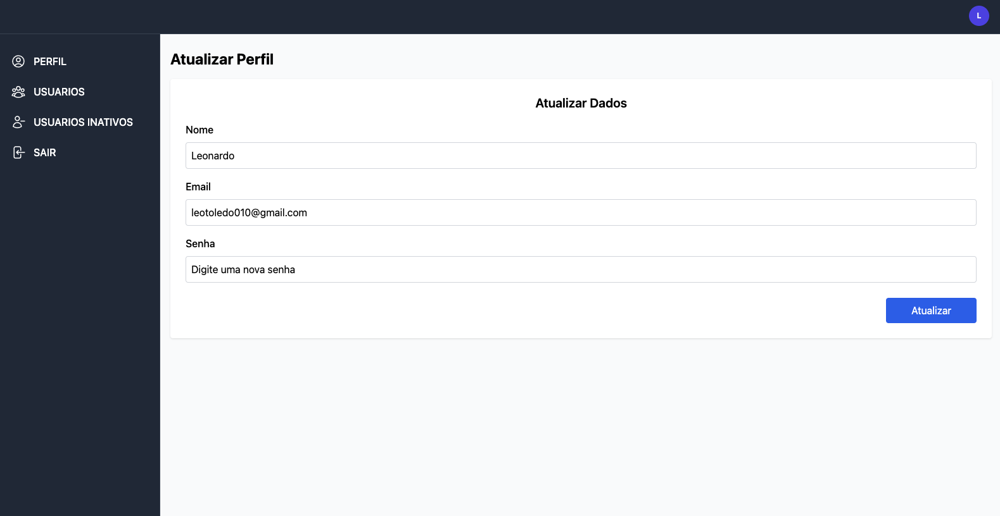

# 🛠️ Conectar - Plataforma Web para Controle de Acesso e Usuários

Frontend da **Conéctar**, plataforma de gestão de usuários com autenticação JWT.  
Construído em React 18 + TypeScript + TailwindCSS + Vite e pronto para produção.

🔗 **Deploy:** [https://seusite.com](https://seusite.com)

## 📄 Licença


> ⚠️ Recomendamos usar Node.js v18 ou superior para compatibilidade com as dependências.

---

## 🚀 Tecnologias Utilizadas

<p align="center"> 
 
 
 
 

 
 


---

---

## ✨ Recursos

| Tela              | Descrição                                   |
|-------------------|---------------------------------------------|
| **Login**         | Formulário com email e senha, login social opcional |
| **Cadastro**      | Cadastro simples com nome, email e senha     |
| **Listagem (Admin)** | Visualização de usuários, filtro e ações    |
| **Perfil do Usuário**| Visualiza e edita dados pessoais e senha    |
| **Responsividade** | Layout adaptado para desktop e dispositivos móveis |
| **Inativos** | `/users/inactive?days=30` lista contas sem login há *n* dias |


---
---

## 🚀 Stack

- **ReactJS 18** + **TypeScript 5**
- **Vite** para bundling rápido e eficiente
- **Tailwind CSS** + **Flowbite** para UI moderna
- **React Router DOM** para rotas privadas e públicas
- **Axios** para comunicação com API
- **Zustand** (ou Context API) para gerenciamento de estado
- **Yarn** scripts com **Husky + Lint-staged**
- **JWT** (access + refresh tokens)

---
## 📦 Instalação

```bash
git clone https://github.com/LeonardoToledo0/Desafio-Conectar-Frontend.git
cd conectar-frontend
yarn
cp .env.example .env
```

Configure o `.env`:

```env
# App
VITE_API_URL=


```

---
---

## ▶️ Execução

| Comando        | Ação                          |
|----------------|-------------------------------|
| `yarn dev`     | Inicia o servidor de desenvolvimento |
| `npm run dev`  | Inicia o servidor de desenvolvimento |

Acesse: [http://localhost:5173](http://localhost:5173)

---

---

## ✅ Funcionalidades

- 🔐 **Autenticação segura com JWT**  
- 👤 **Cadastro e login de usuários**  
- 🧾 **Listagem de usuários** (com filtros por nome, role, data e status)  
- 🛂 **Visualização e edição do próprio perfil**  
- 📌 **Atualização e deleção de usuários (admin)**  
- 🚫 **Listagem de usuários inativos** (filtro por dias)  
- 🔎 **Busca por ID com validação de permissão**  
- 🧩 **Swagger completo com testes via token Bearer**  
- ✅ **Guards de autenticação e autorização**  
- 🧪 **Testes unitários com Jest**  

---
---

## 🧪 Testes

```bash
yarn test
```

---
## 📂 Estrutura

```
src/
├── assets/               # Imagens e recursos estáticos
├── features/
│   ├── admin/            # Páginas do admin
│   ├── auth/             # Login e registro
│   └── users/            # Perfil do usuário
├── routes/               # Definição de rotas públicas e privadas
├── shared/               # Componentes e serviços reutilizáveis
│   ├── components/
│   ├── constants/
│   ├── hooks/
│   ├── service/
│   ├── types/
│   └── utils/
├── styles/               # Estilização global
├── App.tsx               # Componente principal
└── main.tsx              # Ponto de entrada

```

---

## 📲 Funcionalidades

### 🔐 Tela de Login
- Formulário com campos de **email** e **senha**.
- Redirecionamento:
  - 👑 Admin → listagem de usuários.
  - 👤 Usuário → tela de perfil.
  

---

### 📝 Tela de Cadastro
- Campos: **nome**, **email** e **senha**.
- Após o cadastro, redirecionamento automático para o login.


---

### 👥 Tela de Listagem de Usuários (Admins)
- Exibição de **nome**, **email**, **papel** e **status** (ativo/inativo).
-  Botões de **editar** e **excluir**.
- Filtros por **papel** e ordenação por **nome** ou **data de criação**.




---

### 👤 Tela de Perfil do Usuário
- Exibição dos dados do usuário logado.
- Opção de atualizar **nome** e **senha**.



---

### 📱 Interface Responsiva
- Layout adaptado para **mobile** e **desktop** com Tailwind e Flowbite.

---

## ✍️ Autor

Desenvolvido por **Leonardo Toledo**  
📧 leotoledo010@gmail.com  
🔗 [github.com/leonardotoledo0](https://github.com/LeonardoToledo0)

---
---


## 📄 Licença

Este projeto está licenciado sob a **Licença MIT**.

Veja o arquivo [LICENSE](./LICENSE) para detalhes completos.

---

Você pode usar, modificar e distribuir o código conforme os termos da licença MIT.
